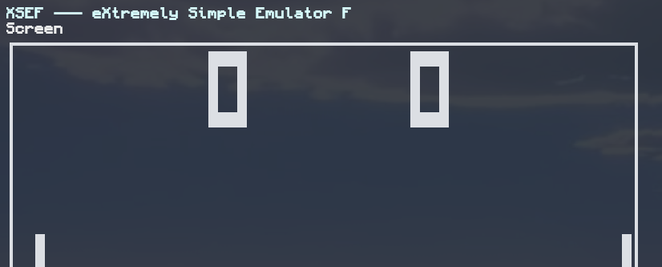

XSef (or eXtremely Simple emulator F) is yet another CHIP-8 emulator with not much else to offer, other than what expected.

> ![WARNING]
> This project in specific was made for educational purposes so there won't be much expansion on THIS repo, I am planning, however, to make more emulators in the future, since this was very fun to make and surprisingly quick (only around 10 hours of active coding and debugging). There are, however, still some issues lingering around that I need to fix, as well as TUI expansions regarding state updating (for the CHIP8 instance) and logging

## Build
XSef was specifically coded towards linux, might add windows support later, but please keep that in mind. The build system used was CMakeLists so make sure you have 

### Requirements
- C++20 Compiler (g++, msvc, clang, ...)
- CMake ー Version 3.10 or higher

### Build Example
```bash
# clone xsef
git clone https://github.com/kashiexe/xsef.git
cd xsef

# create build directory, enter and build the project
mkdir build && cd build && cmake .. && cmake --build .

# now you can run xsef with a specific rom of your choice!
./xsef ../tests/pong.ch8
```

## About XSEF & CHIP8

### In Emulator
You can press "p" to leave